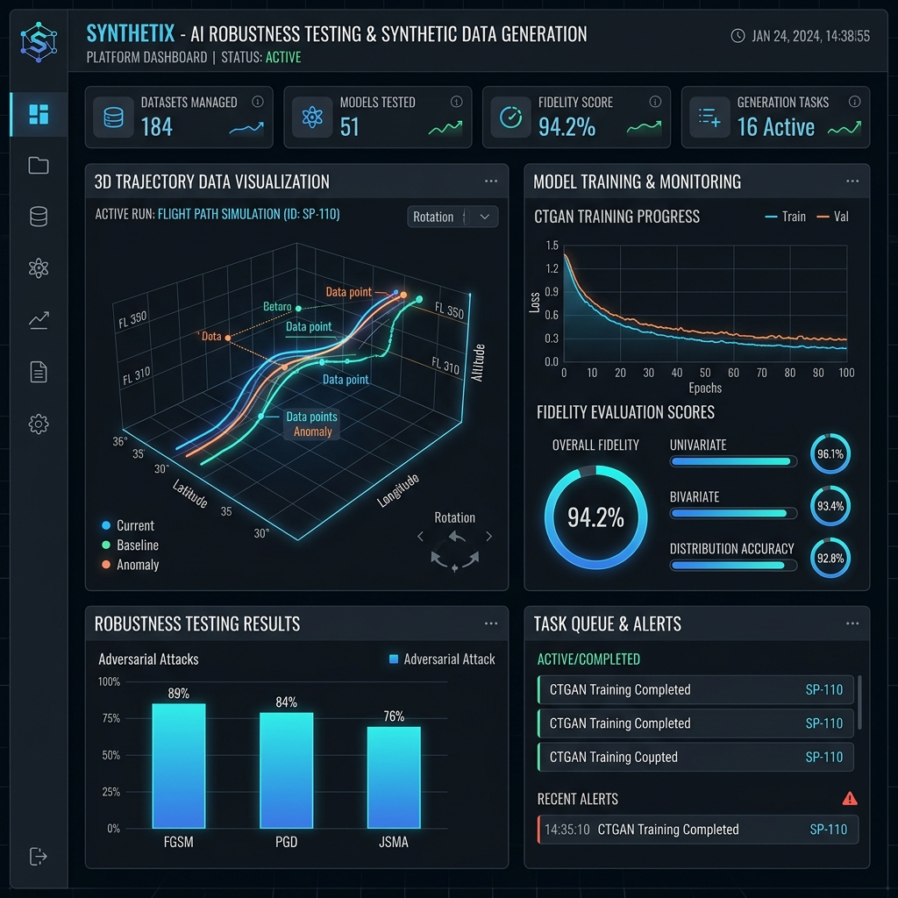
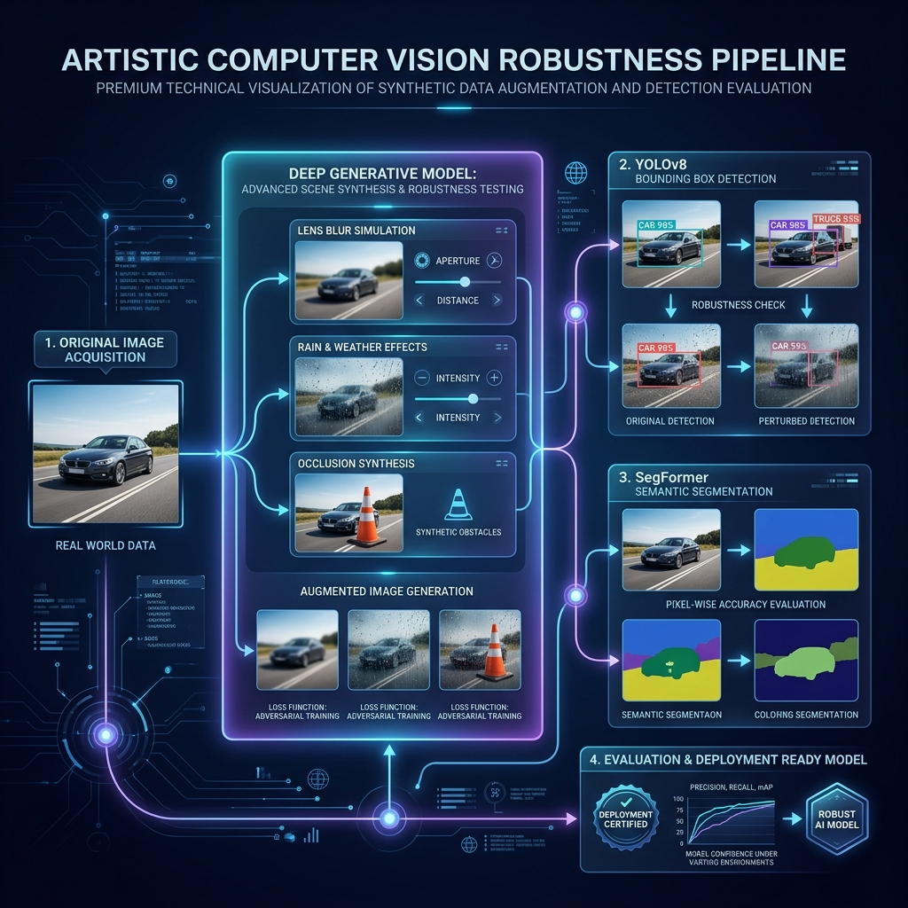
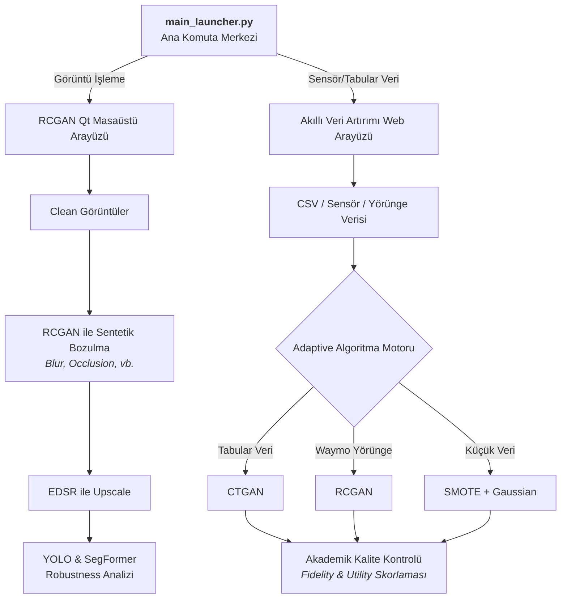

<h1 align="center">
  🚀 Sentetik Veri & Robustness Platformu
</h1>

<p align="center">
  <strong>Görüntü işleme ve yapısal/tabular veri setleri için uçtan uca sentetik veri üretimi, yapay zeka dayanıklılık (robustness) testi ve veri artırımı ekosistemi.</strong>
</p>

<p align="center">
  
  
  
  
  
</p>

---

## 🌟 Proje Vizyonu ve Kapsamı

Bu devasa depo (repository), makine öğrenmesi modellerinin karşılaştığı veri kıtlığı ve çevresel faktörlere karşı kırılganlık sorunlarını çözmek için tasarlanmış **iki ana endüstriyel çözümü** tek bir çatı altında toplar:

1. **📷 Görüntü Robustness Pipeline:** Temiz (clean) kamera görüntülerini alır, **RCGAN** mimarisi ile sentetik olarak bozar (bulanıklık, parlaklık değişimi vb.), **EDSR** ile çözünürlüğünü artırır ve en sonunda **YOLO / SegFormer** modellerinin bu zorlu şartlar altındaki performansını (robustness) analiz eder.
2. **📊 Akıllı Veri Artırımı:** Standart tabular CSV verilerini veya özel **Waymo Yörünge (Trajectory)** verilerini analiz eder; veri yapısına en uygun olan modeli (**RCGAN, CTGAN veya SMOTE**) otomatik seçerek otonom sürüş sistemleri ve sensör ağları için yüksek kaliteli sentetik veri üretir.

Merkezi `main_launcher.py` dosyası, her iki uygulamanın da tek bir tıklama ile yönetilebileceği ana komuta merkezidir.

---

## 📸 Platform Arayüzleri ve Görseller

### 1. Akıllı Veri Artırımı & Kontrol Paneli
<p align="center">
  
</p>

### 2. Bilgisayarlı Görü Dayanıklılık (Robustness) Test Akışı
<p align="center">
  
</p>

---

## 🏗️ Sistem Mimarisi ve İş Akışı

Aşağıdaki şema, platformun iki kola ayrılan ana iş akışını özetlemektedir:



---

## 🔍 Detaylı Sistem Analizi

### 1. Görüntü Robustness Pipeline
Bilgisayarlı görü (CV) modellerinin gerçek hayat şartlarındaki (sis, aşırı yağış, sensör bozulmaları) başarısını test etmek amacıyla tasarlanmış zincirleme bir işlem mimarisidir.

* **Adım 1: RCGAN ile Yapay Bozulma (Synthesizing Perturbations):** RCGAN (Recurrent Conditional GAN) modeli eğitilerek, temiz kamera görüntülerine gerçekçi sis (blur), cisim engellemeleri (occlusion) ve ışık dalgalanmaları (brightness) sentetik olarak enjekte edilir.
* **Adım 2: EDSR ile Süper Çözünürlük (Super Resolution):** Üretilen sentetik ve bozuk görüntüler, **EDSR (Enhanced Deep Residual Single Image Super-Resolution)** modeliyle 4 kat büyütülür (upscale). Bu adım, pikselsel bozulmaları düzelterek nesne algılama başarısını artırmak için kritik öneme sahiptir.
* **Adım 3: YOLOv8 ile Nesne Algılama (Object Detection) Analizi:** Bozulmuş ve ardından upscale edilmiş görüntüler üzerindeki araç, yaya ve trafik işaretleri YOLOv8 ile taranır. Temiz görüntü ile bozulmuş görüntü arasındaki Güven (Confidence Score) ve Tespit Oranı (Recall) kaybı ölçülür.
* **Adım 4: SegFormer ile Semantik Segmentasyon (Semantic Segmentation):** Piksel düzeyinde sınıflandırma yapılarak (yol, kaldırım, gökyüzü, araçlar), derinlik ve mekansal farkındalığın yapay koşullarda ne kadar saptığı ölçülür.

### 2. Akıllı Veri Artırımı (Smart Data Augmentation Engine)
Sistem, yüklenen veri setinin yapısını inceleyen bir **Otomatik Sınıflandırma ve Model Belirleme Motoru** içerir:

* **CTGAN (Conditional Tabular GAN):** Eğer yüklenen veri seti standart tabular / sayısal sensör verisi ise ve yeterli boyuttaysa (100 satır üstü), CTGAN devreye girer. CTGAN, sürekli ve kategorik sütunların olasılık dağılımlarını koruyarak sıfırdan yüksek kaliteli sentetik satırlar üretir.
* **RCGAN (Recurrent Conditional GAN):** Veri setinde yörünge (trajectory) bilgileri, zaman serileri veya ardışık otonom sürüş koordinatları (`x(1)...x(20)`, `speed`, `vx`, `vy`) bulunursa, model otomatik olarak RCGAN motoruna yönlendirilir. RCGAN, zaman serisindeki adımların birbirleriyle olan korelasyonunu korur.
* **SMOTE + Gaussian Fallback:** Veri boyutu 100 satırın altındaysa, derin öğrenme tabanlı GAN modelleri ezberleme (overfitting) yapacağı için, sistem otomatik olarak SMOTE ve Gaussian gürültü ekleme algoritmasına geçiş yapar.

#### 📊 Akademik Değerlendirme (Fidelity & Utility) Metrikleri
Üretilen verinin kalitesi sadece görsel değil, matematiksel ve istatistiksel testlerden geçirilir:
* **Fidelity (Benzerlik) Analizi:**
  * *Cosine Similarity:* Orijinal ve sentetik veri kümelerinin ortalama vektörleri arasındaki kosinüs benzerliği ölçülür.
  * *Correlation Comparison:* Sütunların kendi aralarındaki korelasyon matrisleri karşılaştırılarak, sentetik verinin orijinal verideki ilişkileri koruma başarısı test edilir.
* **Utility (Kullanılabilirlik/Yararlılık) Analizi:**
  * Orijinal veri üzerinde bir **Gradient Boosting Classifier** eğitilir (`Seed Model`) ve test edilir.
  * Ardından, orijinal + sentetik verinin birleşimi üzerinde aynı parametrelerle yeni bir model eğitilir (`Augmented Model`).
  * İki model aynı bağımsız test verisinde yarıştırılır. Sentetik verinin model başarısını (özellikle veri seti dengesiz ise azınlık sınıfı recall değerini) ne kadar artırdığı raporlanır.

---

## 📁 Proje Yapısı (Directory Structure)

```text
📦 projects/
 ┣ 📂 akilli_veri_arttirimi/   # Tabular/Yörünge veri artırımı (CTGAN/RCGAN) platformu
 ┃ ┣ 📂 backend/               # FastAPI sunucusu ve veri işleme motorları
 ┃ ┣ 📂 docs/                  # Akıllı Veri Artırımı özel dokümantasyonu
 ┃ ┣ 📂 otonom_env/            # Veri artırımı özel Python sanal ortamı (venv)
 ┃ ┗ 📜 requirements.txt       # Veri artırımı kütüphaneleri (PyTorch, CTGAN, vb.)
 ┣ 📂 detector/                # YOLO, SegFormer ve EDSR yapay zeka modelleri
 ┣ 📂 rcgan_qt_gui_app_v1/     # Görüntü Robustness için Qt tabanlı kullanıcı arayüzü
 ┃ ┣ 📂 qtvenv/                # Görüntü işleme özel Python sanal ortamı (venv)
 ┃ ┗ 📜 requirements_qt.txt    # Görüntü işleme kütüphaneleri (Qt, Ultralytics, vb.)
 ┣ 📂 docs/                    # Genel proje dokümantasyonu ve görseller
 ┃ ┗ 📂 images/                # Dashboard ve Infografik görselleri
 ┣ 📂 clean/                   # Referans alınan temiz kamera görüntüleri
 ┣ 📂 outputs/                 # Üretilen sentetik ve bozulmuş görüntüler
 ┣ 📂 results/                 # Metrikler, tespit haritaları ve kapsamlı performans raporları
 ┣ 📜 main_launcher.py         # Tüm sistemi başlatan ana kontrol ekranı
 ┗ 📜 PROJE_NOTLARI.md         # Kapsamlı geliştirme ve mühendislik notları
```

---

## ⚙️ Git LFS (Büyük Dosya Yönetimi)

Bu projede devasa boyutlu Derin Öğrenme modelleri ve dev veri setleri **Git LFS** ile barındırılmaktadır. Repoyu klonlamadan önce Git LFS'in kurulu olması **ZORUNLUDUR**.

Takip edilen LFS uzantıları: `*.pt`, `*.pth`, `*.pb`, `waymo_seed_MASSIVE.csv`

**macOS Kurulumu:**
```bash
brew install git-lfs
git lfs install
```

**Windows Kurulumu:**
```powershell
git lfs install
```

*(Eğer modeller eksik inerse veya 1 KB boyutunda görünürse, depo dizinindeyken `git lfs pull` komutunu çalıştırın.)*

---

## 🚀 Başlangıç ve Sıfırdan Kurulum

### 1. Repoyu Klonlama

```bash
git clone https://github.com/squichip/sentetik-veri-platformu.git
cd sentetik-veri-platformu
git lfs pull
```

`git lfs pull` sonrasında özellikle şu dosyaların gerçek boyutta olduğundan emin olun:

- `rcgan_qt_gui_app_v1/checkpoint_epoch_29.pt`
- `detector/EDSR_x4.pb`
- `detector/yolov8n.pt`
- `akilli_veri_arttirimi/waymo_seed_MASSIVE.csv`
- `akilli_veri_arttirimi/outputs/waymo_rcgan_GODMODE_A100_STABLE.pth`

### 2. Sanal Ortam Mantığı

Projede iki ayrı Python ortamı kullanılır. Bu bilinçli bir ayrımdır:

- `rcgan_qt_gui_app_v1/qtvenv`: Ana launcher, RCGAN görüntü arayüzü ve detector/YOLO/SegFormer pipeline için.
- `akilli_veri_arttirimi/otonom_env`: CSV/tabular veri artırımı, FastAPI, CTGAN/RCGAN ve pywebview arayüzü için.

Ana uygulama her zaman kök dizindeki `main_launcher.py` dosyasıdır ve `qtvenv` ile çalıştırılır. Launcher içinden **Akıllı Veri Artırımı** butonuna basıldığında, arka planda `akilli_veri_arttirimi/otonom_env` kullanılır.

---

## 🛠️ Kurulum Talimatları

### macOS / Linux

**Görüntü Robustness Pipeline ve ana launcher:**

```bash
cd sentetik-veri-platformu/rcgan_qt_gui_app_v1
python3 -m venv qtvenv
source qtvenv/bin/activate
python -m pip install --upgrade pip
python -m pip install -r requirements_qt.txt
python -m pip install opencv-contrib-python matplotlib pandas tqdm ultralytics transformers
cd ..
python main_launcher.py
```

**Akıllı Veri Artırımı ortamı:**

```bash
cd sentetik-veri-platformu/akilli_veri_arttirimi
python3.11 -m venv otonom_env
source otonom_env/bin/activate
python -m pip install --upgrade pip
python -m pip install -r requirements.txt
```

İsterseniz veri artırımı uygulamasını tek başına da açabilirsiniz:

```bash
python main.py
```

### Windows PowerShell

> Windows'ta `source .../bin/activate` çalışmaz. PowerShell için `.\...\Scripts\Activate.ps1` kullanılmalıdır.

**1. Git LFS'i hazırlayın ve repoyu çekin:**

```powershell
git lfs install
git clone https://github.com/squichip/sentetik-veri-platformu.git
cd sentetik-veri-platformu
git lfs pull
```

**2. Ana launcher + görüntü pipeline ortamını kurun (`qtvenv`):**

```powershell
cd C:\Users\<kullanici-adiniz>\sentetik-veri-platformu
py -3.10 -m venv .\rcgan_qt_gui_app_v1\qtvenv
.\rcgan_qt_gui_app_v1\qtvenv\Scripts\Activate.ps1
python -m pip install --upgrade pip
python -m pip install -r .\rcgan_qt_gui_app_v1\requirements_qt.txt
python -m pip install opencv-contrib-python matplotlib pandas tqdm ultralytics transformers
```

`opencv-contrib-python` önemlidir; EDSR upscale adımındaki `cv2.dnn_superres` modülü standart `opencv-python` paketinde bulunmayabilir.

**3. Akıllı Veri Artırımı ortamını kurun (`otonom_env`):**

```powershell
cd C:\Users\<kullanici-adiniz>\sentetik-veri-platformu\akilli_veri_arttirimi
py -3.11 -m venv otonom_env
.\otonom_env\Scripts\Activate.ps1
python -m pip install --upgrade pip
python -m pip install -r requirements.txt
```

Akıllı Veri Artırımı için Python 3.11 önerilir. Python 3.10 ile `contourpy==1.3.3 Requires-Python >=3.11` gibi paket uyumsuzluğu alınabilir.

**4. Ana launcher'ı başlatın:**

```powershell
cd C:\Users\<kullanici-adiniz>\sentetik-veri-platformu
.\rcgan_qt_gui_app_v1\qtvenv\Scripts\Activate.ps1
python main_launcher.py
```

Bu pencere üzerinden iki uygulamayı da açabilirsiniz:

- **Görüntü Robustness Pipeline**: `qtvenv` ile çalışır.
- **Akıllı Veri Artırımı**: `akilli_veri_arttirimi\otonom_env` ile çalışır.

Akıllı Veri Artırımı'nı doğrudan açmak isterseniz:

```powershell
cd C:\Users\<kullanici-adiniz>\sentetik-veri-platformu\akilli_veri_arttirimi
.\otonom_env\Scripts\Activate.ps1
python main.py
```

---

## 📡 Özel Mühendislik Çözümü: WebKit Timeout Aşımı
FastAPI backend mimarisinde, çok derin CTGAN eğitimleri veya büyük veri setlerinin Gradient Boosting ile değerlendirilmesi 1 dakikadan uzun sürebilmektedir. macOS WebKit (`pywebview` masaüstü motoru) varsayılan olarak 60. saniyede ağ isteklerini zaman aşımına uğratıp bağlantıyı kesmekteydi.

**Nasıl Çözdük?**
Arayüzdeki standart `fetch` API'sini tamamen kaldırıp, yerine **XMLHttpRequest (XHR)** mimarisine geçiş yaptık ve arayüze özel olarak **300.000 ms (5 dakika) zaman aşımı** tanımladık:
```javascript
const xhr = new XMLHttpRequest();
xhr.open("POST", API + '/api/evaluate_pipeline', true);
xhr.timeout = 300000; // 5 dakikalık genişletilmiş WebKit desteği
```
Bu sayede en ağır veri setleri dahi arayüz bağlantısı kopmadan en üst kalitede eğitilip değerlendirilebilmektedir.

---

## 💡 Sık Karşılaşılan Sorunlar (Troubleshooting)

| Sorun | Çözüm Yöntemi |
|---|---|
| **Modeller veya CSV'ler Çalışmıyor (1 KB Görünüyor)** | Git LFS kurulmamış. `git lfs install` ve ardından `git lfs pull` komutunu çalıştırın. |
| **PowerShell'de `source` komutu çalışmıyor** | `source` macOS/Linux komutudur. Windows PowerShell'de görüntü ortamı için `.\rcgan_qt_gui_app_v1\qtvenv\Scripts\Activate.ps1`, veri artırımı için `.\akilli_veri_arttirimi\otonom_env\Scripts\Activate.ps1` kullanın. |
| **`Activate.ps1 cannot be loaded because running scripts is disabled`** | PowerShell script çalıştırma izni kapalıdır. Bir kez `Set-ExecutionPolicy -Scope CurrentUser RemoteSigned` çalıştırıp terminali yeniden deneyin. |
| **`ModuleNotFoundError: No module named 'PySide6'`** | Ana launcher `qtvenv` ile açılır. Kök dizinde `.\rcgan_qt_gui_app_v1\qtvenv\Scripts\Activate.ps1` çalıştırın, sonra `python -m pip install -r .\rcgan_qt_gui_app_v1\requirements_qt.txt` kurun. |
| **`ModuleNotFoundError: No module named 'requests'`, `fastapi`, `uvicorn`, `torch`, `pandas`, `sklearn`** | Bu hata Akıllı Veri Artırımı ortamının eksik olduğunu gösterir. `cd akilli_veri_arttirimi`, `.\otonom_env\Scripts\Activate.ps1`, `python -m pip install -r requirements.txt` komutlarını çalıştırın. |
| **`contourpy==1.3.3 Requires-Python >=3.11` veya `No matching distribution found for contourpy==1.3.3`** | Windows'taki `otonom_env` Python 3.10 ile oluşturulmuş olabilir. Akıllı Veri Artırımı için ortamı Python 3.11 ile kurun: `py -3.11 -m venv otonom_env`. |
| **`AttributeError: module 'cv2' has no attribute 'dnn_superres'`** | EDSR upscale için standart `opencv-python` yetmez. `qtvenv` aktifken `python -m pip uninstall opencv-python opencv-python-headless opencv-contrib-python -y` ve ardından `python -m pip install opencv-contrib-python` çalıştırın. |
| **OpenCV `FAILED: fs.is_open(). Can't open "...\detector\EDSR_x4.pb"` hatası** | Windows'ta Türkçe karakterli kullanıcı yolu (`C:\Users\özcan\...`) OpenCV C++ okumasında sorun çıkarabilir. Güncel kod modeli `C:\Users\Public\sentetik_veri_platformu_cv2\EDSR_x4.pb` altına kopyalayıp oradan okur. Yine hata alınırsa repoyu ASCII karakterli bir klasöre taşıyın, örn. `C:\projects\sentetik-veri-platformu`. |
| **`UnicodeEncodeError: 'charmap' codec can't encode character`** | Windows konsolu emoji/UTF-8 çıktıyı yazamıyor olabilir. Güncel `main_launcher.py` alt süreçleri `PYTHONIOENCODING=utf-8` ve `PYTHONUTF8=1` ile başlatır. Doğrudan terminalden çalıştırıyorsanız önce `$env:PYTHONIOENCODING='utf-8'; $env:PYTHONUTF8='1'` yazabilirsiniz. |
| **`ModuleNotFoundError` Hatası Alıyorum** | Yanlış sanal ortamdasınız. Görüntü modülü ve `main_launcher.py` için `qtvenv`, Veri Artırımı için `otonom_env` aktif olmalıdır. |
| **Port 8000 veya 8001 Kullanımda Hatası** | Arka planda açık kalmış `python main.py` veya `server.py` sürecini terminalden sonlandırın (Ctrl+C). |
| **`Load failed` veya Zaman Aşımı Hatası (Veri Artırımı)** | Aşırı büyük veri setlerinde (CTGAN ile) sistem uzun sürebilir. *Not: Altyapı artık 5 dakikalık genişletilmiş WebKit XHR timeout desteğiyle çalışmaktadır.* |
| **Hugging Face `symlinks` uyarısı** | Windows'ta geliştirici modu kapalı olduğunda görülebilir. Kritik değildir; model cache daha fazla disk kullanabilir. İsterseniz Windows Developer Mode açılabilir veya `HF_HUB_DISABLE_SYMLINKS_WARNING=1` ayarlanabilir. |
| **`QProcess: Destroyed while process ... is still running`** | Ana launcher kapatılırken alt uygulamalardan biri hâlâ çalışıyordur. Önce alt uygulama pencerelerini kapatın, sonra launcher'ı kapatın. |
| **macOS `AVFFrameReceiver` Uyarısı** | `av` ve `opencv-python` kütüphanelerinin C++ çakışmasından kaynaklanan zararsız bir uyarıdır. |

---

## 👨‍💻 Geliştirme ve Mimari Kararlar

Projenin altında yatan teorik yaklaşımlar, yaşanan darboğazlar ve alınan mimari kararlar (örneğin; neden Time-Series için Min-Max yerine fiziksel limitasyon uygulandığı, macOS kilitlenmelerini aşmak için FastAPI Streaming/XHR çözümlerinin nasıl uygulandığı) hakkında kapsamlı okuma yapmak için kök dizindeki **`PROJE_NOTLARI.md`** belgesini inceleyebilirsiniz.

---
<p align="center">
  <i>Ali Turhan ve Özcan Yıldıral tarafından yüksek akademik ve endüstriyel standartlarla tasarlanmıştır.</i>
</p>
