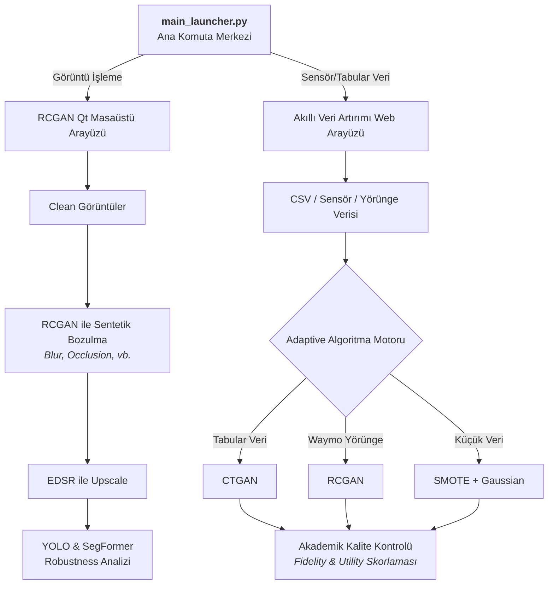

<h1 align="center">
  🚀 Sentetik Veri & Robustness Platformu
</h1>

<p align="center">
  <strong>Görüntü işleme ve yapısal/tabular veri setleri için uçtan uca sentetik veri üretimi, yapay zeka dayanıklılık (robustness) testi ve veri artırımı ekosistemi.</strong>
</p>

<p align="center">
  
  
  
  
  
</p>

---

## 🌟 Proje Vizyonu ve Kapsamı

Bu devasa depo (repository), makine öğrenmesi modellerinin karşılaştığı veri kıtlığı ve çevresel faktörlere karşı kırılganlık sorunlarını çözmek için tasarlanmış **iki ana endüstriyel çözümü** tek bir çatı altında toplar:

1. **📷 Görüntü Robustness Pipeline:** Temiz (clean) kamera görüntülerini alır, **RCGAN** mimarisi ile sentetik olarak bozar (bulanıklık, parlaklık değişimi vb.), **EDSR** ile çözünürlüğünü artırır ve en sonunda **YOLO / SegFormer** modellerinin bu zorlu şartlar altındaki performansını (robustness) analiz eder.
2. **📊 Akıllı Veri Artırımı:** Standart tabular CSV verilerini veya özel **Waymo Yörünge (Trajectory)** verilerini analiz eder; veri yapısına en uygun olan modeli (**RCGAN, CTGAN veya SMOTE**) otomatik seçerek otonom sürüş sistemleri ve sensör ağları için yüksek kaliteli sentetik veri üretir.

Merkezi `main_launcher.py` dosyası, her iki uygulamanın da tek bir tıklama ile yönetilebileceği ana komuta merkezidir.

---

## 🏗️ Mimari ve İş Akışı

Aşağıdaki şema, platformun iki kola ayrılan ana iş akışını özetlemektedir:



---

## 📁 Proje Yapısı (Directory Structure)

```text
📦 projects/
 ┣ 📜 main_launcher.py         # Tüm sistemi başlatan ana kontrol ekranı
 ┣ 📜 PROJE_NOTLARI.md         # Kapsamlı geliştirme ve mühendislik notları
 ┣ 📂 rcgan_qt_gui_app_v1/     # Görüntü Robustness için Qt tabanlı kullanıcı arayüzü
 ┣ 📂 detector/                # YOLO, SegFormer ve EDSR yapay zeka modelleri
 ┣ 📂 akilli_veri_arttirimi/   # Tabular/Yörünge veri artırımı (CTGAN/RCGAN) platformu
 ┣ 📂 clean/                   # Referans alınan temiz kamera görüntüleri
 ┣ 📂 outputs/                 # Üretilen sentetik ve bozulmuş görüntüler
 ┗ 📂 results/                 # Metrikler, tespit haritaları ve kapsamlı performans raporları
```

---

## ⚙️ Git LFS (Büyük Dosya Yönetimi)

Bu projede devasa boyutlu Derin Öğrenme modelleri ve dev veri setleri **Git LFS** ile barındırılmaktadır. Repoyu klonlamadan önce Git LFS'in kurulu olması **ZORUNLUDUR**.

Takip edilen LFS uzantıları: `*.pt`, `*.pth`, `*.pb`, `waymo_seed_MASSIVE.csv`

**macOS Kurulumu:**
```bash
brew install git-lfs
git lfs install
```

**Windows Kurulumu:**
```powershell
git lfs install
```

*(Eğer modeller eksik inerse veya 1 KB boyutunda görünürse, depo dizinindeyken `git lfs pull` komutunu çalıştırın.)*

---

## 🚀 Başlangıç ve Sıfırdan Kurulum

### 1. Repoyu Klonlama

```bash
git clone https://github.com/squichip/sentetik-veri-platformu.git
cd sentetik-veri-platformu
git lfs pull
```

### 2. Sanal Ortamlar (Virtual Environments)
Sistem çakışmalarını önlemek için projede iki farklı sanal ortam (venv) kullanılmaktadır:
* `qtvenv`: Görüntü arayüzü ve bilgisayarlı görü (CV) modelleri için.
* `otonom_env`: Veri artırımı ve istatistiksel modeller için.

---

## 🛠️ Kurulum Talimatları

<details open>
<summary><b>1️⃣ Görüntü Robustness Pipeline Kurulumu</b></summary>
<br>

**1. Sanal Ortam Oluştur:**
```bash
cd rcgan_qt_gui_app_v1
python -m venv qtvenv
source qtvenv/bin/activate
python -m pip install --upgrade pip
```
*(Windows için: `qtvenv\Scripts\activate`)*

**2. Gereksinimleri Yükle:**
```bash
pip install -r requirements_qt.txt
pip install opencv-python matplotlib pandas tqdm ultralytics transformers
```
*Not: YOLO ve SegFormer modelleri, ilk çalıştırmada Hugging Face ve Ultralytics üzerinden gerekli model ağırlıklarını indirecektir.*

**3. Uygulamayı Başlat:**
```bash
cd ..
python main_launcher.py
```
</details>

<details open>
<summary><b>2️⃣ Akıllı Veri Artırımı Kurulumu (ÖNEMLİ)</b></summary>
<br>

**1. Sanal Ortam Oluştur:**
```bash
cd akilli_veri_arttirimi
python -m venv otonom_env
source otonom_env/bin/activate
python -m pip install --upgrade pip
```
*(Windows için: `otonom_env\Scripts\activate`)*

**2. Gereksinimleri Yükle:**
```bash
pip install -r requirements.txt
```

**3. LFS Modellerini Kontrol Et:**
Şu büyük dosyaların tam boyutuyla indiğinden emin olun (Gerekirse `git lfs pull` yapın):
* `akilli_veri_arttirimi/waymo_seed_MASSIVE.csv`
* `akilli_veri_arttirimi/outputs/waymo_rcgan_GODMODE_A100_STABLE.pth`

**4. Uygulamayı Başlat:**
```bash
python main.py
```
Veya doğrudan kök klasörden ana launcher ile başlatabilirsiniz:
```bash
cd /path/to/sentetik-veri-platformu
source rcgan_qt_gui_app_v1/qtvenv/bin/activate
python main_launcher.py
```
*(Launcher, arka planda otonom_env'yi bularak sunucuyu doğru ortamda başlatır.)*
</details>

---

## 💡 Sık Karşılaşılan Sorunlar (Troubleshooting)

| Sorun | Çözüm Yöntemi |
|---|---|
| **Modeller veya CSV'ler Çalışmıyor (1 KB Görünüyor)** | Git LFS kurulmamış. `git lfs install` ve ardından `git lfs pull` komutunu çalıştırın. |
| **`ModuleNotFoundError` Hatası Alıyorum** | Yanlış sanal ortamdasınız. Görüntü modülü için `qtvenv`, Veri modülü için `otonom_env`'yi aktif edin (`source bin/activate`). |
| **Port 8000 veya 8001 Kullanımda Hatası** | Arka planda açık kalmış `python main.py` veya `server.py` sürecini terminalden sonlandırın (Ctrl+C). |
| **`Load failed` veya Zaman Aşımı Hatası (Veri Artırımı)** | Aşırı büyük veri setlerinde (CTGAN ile) sistem uzun sürebilir. *Not: Altyapı artık 5 dakikalık genişletilmiş WebKit XHR timeout desteğiyle çalışmaktadır.* |
| **macOS `AVFFrameReceiver` Uyarısı** | `av` ve `opencv-python` kütüphanelerinin C++ çakışmasından kaynaklanan zararsız bir uyarıdır. |

---

## 👨‍💻 Geliştirme ve Mimari Kararlar

Projenin altında yatan teorik yaklaşımlar, yaşanan darboğazlar ve alınan mimari kararlar (örneğin; neden Time-Series için Min-Max yerine fiziksel limitasyon uygulandığı, macOS kilitlenmelerini aşmak için FastAPI Streaming/XHR çözümlerinin nasıl uygulandığı) hakkında kapsamlı okuma yapmak için kök dizindeki **`PROJE_NOTLARI.md`** belgesini inceleyebilirsiniz.

---
<p align="center">
  <i>Squichip tarafından yüksek endüstriyel standartlarla tasarlanmıştır.</i>
</p>
